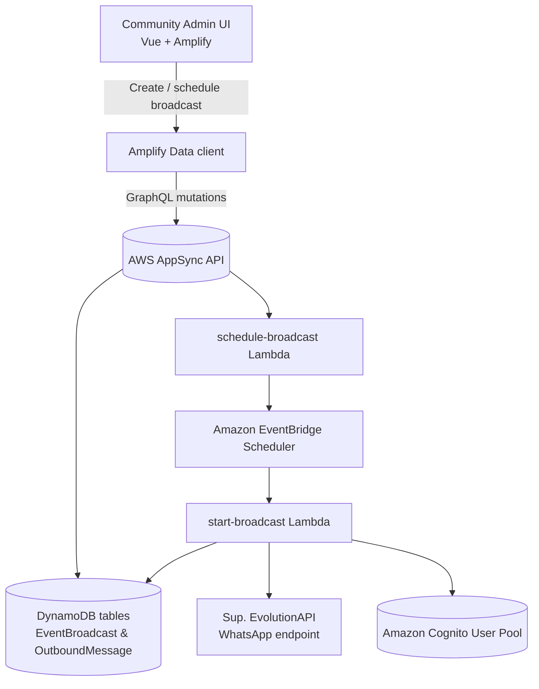
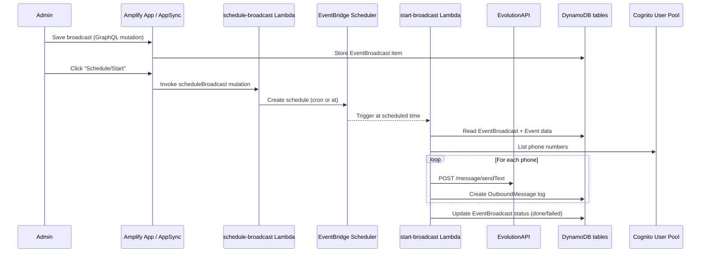

# Event Broadcast Automation Samples

User Group leaders often need to nudge their members before an event starts.  
This repository explains how our automation sends WhatsApp notifications via EvolutionAPI using AWS Amplify, AppSync, DynamoDB, and a pair of Lambdas.

## What this feature does
- Admins create a **Broadcast** in the web app, choose the message text, and decide when it should run (`NOW`, `AT`, or `CRON` schedule).
- The broadcast configuration lives in DynamoDB (through Amplify Data / AppSync) so we can track templates and delivery logs.
- When the time comes, a Lambda calls the **EvolutionAPI** WhatsApp endpoint for every user who opted into WhatsApp notifications.
- Each attempt is recorded, so we know which recipients succeeded or failed.

## High-level architecture

### How the services collaborate
1. **Admin UI** - uses Amplify Data (GraphQL) to create or edit `EventBroadcast` items.
2. **AppSync + DynamoDB** - store the template text, schedule type, and the resulting `OutboundMessage` log entries.
3. **`schedule-broadcast` Lambda** - takes the admin request, builds the right cron/`at()` expression, and asks EventBridge Scheduler to invoke `start-broadcast` at the right time.
4. **Amazon EventBridge Scheduler** - guarantees the trigger fires exactly when requested (either immediately or on a recurring cron).
5. **`start-broadcast` Lambda** - fetches the `EventBroadcast`, lists user phones from Cognito, sends WhatsApp messages through EvolutionAPI, and writes status rows back to DynamoDB.

## DynamoDB data model (via Amplify Data)
- **EventBroadcast** - stores the message template, schedule type, and status.
- **OutboundMessage** - captures per-user delivery attempts (`PENDING`, `SENT`, `RECEIVED`), provider IDs, and timestamps.

These tables are surfaced as GraphQL types in Amplify Data, so the admin UI can query and mutate them securely (restricted to the `ADMINS` group).

## Key AWS & partner components
- **AWS Amplify** - bootstraps the GraphQL schema, generates clients, and injects env vars into the Lambdas.
- **AWS AppSync** - hosts the GraphQL API that the UI and Lambdas use.
- **Amazon DynamoDB** - backing store for broadcasts and delivery logs.
- **Amazon Cognito** - stores user profiles and phone numbers; Lambdas list recipients from here.
- **AWS Lambda** - two functions (`schedule-broadcast` and `start-broadcast`) handle orchestration and delivery.
- **Amazon EventBridge Scheduler** - fires the delivery Lambda at either a specific time or on a cron schedule.
- **EvolutionAPI (open-source WhatsApp gateway)** - our Lambdas call the `/message/sendText/{instance}` endpoint hosted on our own EC2 box; see [Self-hosted Evolution API](evolution-self-hosting.md) for details and links to the [official docs](https://doc.evolution-api.com/v2/pt/get-started/introduction).

### Why EvolutionAPI?
EvolutionAPI keeps the actual WhatsApp Web session inside our AWS account. Authenticated requests include:
- Base URL `https://evolution.seudominio.com.br`
- Instance ID identifying the paired WhatsApp device
- `apiKey` header stored as the Amplify secret `EVOLUTION_API_KEY`

The same instance powers both the old n8n flows and the new Amplify Lambdas, so no matter which platform triggers a broadcast the message is routed through the self-hosted connector.

## Code deep dive
- `schema-scheduler.md` - includes a trimmed version of the Amplify schema for `EventBroadcast`/`OutboundMessage` plus the scheduling Lambda handler.
- `start-broadcast.md` - focuses on the delivery Lambda loop, Cognito recipient lookup, and EvolutionAPI call pattern.
- `evolution-self-hosting.md` - describes the EC2 t3.small, Docker, Nginx, TLS, and pairing steps that keep our Evolution API online.
- `legacy-n8n-workflow.md` - documents the original automation based on Google Sheets + n8n for those who still want a low-code entry point.

## From n8n workflows to a platform
Before this Amplify redesign we maintained the [Wpp-Automation-Events](https://github.com/Comunidade-AWS-BSB/Wpp-Automation-Events) repository with Google Sheets, n8n, and the same Evolution API container. The new platform keeps the hosting model but replaces spreadsheets and cron-like flows with:
- AppSync/DynamoDB schema for broadcasts and delivery logs
- Cognito as the source of recipient data, instead of manual Sheets
- EventBridge Scheduler for reliable triggers

Read [legacy-n8n-workflow.md](legacy-n8n-workflow.md) for the full recipe if you want to replicate the earlier approach or understand how we evolved the architecture.

---

### Developed by Miguel Fernando/FernandoAurelius, member of the AWS User Group Brasília.
- *If you liked this solution please feel free to reach me out in [LinkedIn](https://linkedin.com/in/devflores) or check my [GitHub](https://github.com/FernandoAurelius) profile!*
